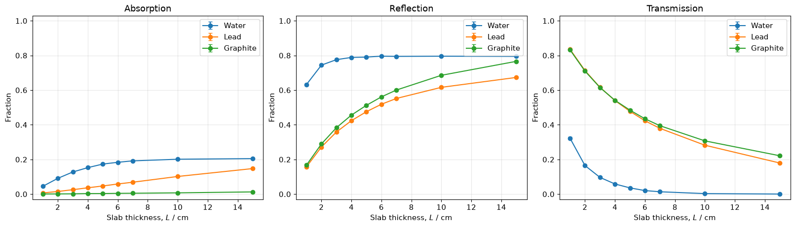
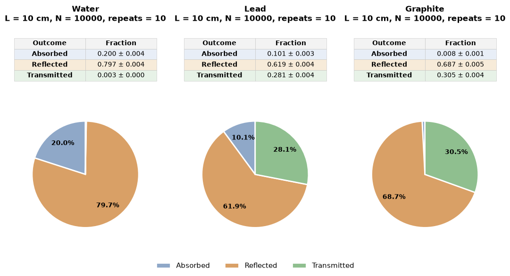

# Monte Carlo Neutron Transport

**A computational physics study of absorption, reflection and transmission in shielding slabs, with an exploratory machine-learning surrogate.**

Python · NumPy · Monte Carlo · Woodcock tracking · scikit-learn



## Overview

How do absorption and scattering change the fraction of neutrons that cross a material? This project follows individual thermal-neutron histories through water, lead and graphite. It connects random sampling, particle transport, statistical uncertainty and a small surrogate-modelling experiment.

Developed from PHYS20762 Computational Physics coursework by **Ruijia Liu**. See [provenance and changes](docs/PROVENANCE.md) for the distinction between the original coursework and subsequent portfolio preparation.

## What this project demonstrates

- Inverse-CDF free-path sampling and isotropic scattering-direction sampling.
- Vectorised tracking of active particles through homogeneous slabs.
- Absorption, reflection and transmission tallies, including a thickness scan.
- Woodcock (delta) tracking through two adjacent material layers.
- Effective attenuation fits with fit-quality diagnostics.
- A random-forest surrogate evaluated against simple baselines and held-out thicknesses.

## Results and interpretation

In this fixed-cross-section model, water strongly suppresses transmission through repeated scattering and reflection. Lead has a larger absorption contribution than graphite. The full outcome balance matters: reduced transmission does not imply that every missing neutron was absorbed.



The surrogate dataset contains **24 configurations**: four ordered lead/graphite pairs at six equal-layer thicknesses. Each target averages three simulations of 3,000 incident neutrons. The original 70/30 random configuration split gives a strong score, but it does not test wholly unseen thicknesses.

The more demanding leave-one-thickness-out evaluation exposes the limitation:

| Evaluation | Random forest MAE | Training-mean MAE | Same-pair baseline MAE |
|---|---:|---:|---:|
| Interior held-out thicknesses | 0.0897 | 0.0902 | **0.0260** |
| Held-out endpoints | 0.1425 | 0.2744 | **0.1395** |

MAE is an absolute transmission fraction; 0.01 equals one percentage point. The same-pair baseline uses linear interpolation between training thicknesses, or the nearest training endpoint outside the range. These are exploratory cross-validation results without hyperparameter tuning. They show why a high random-split score alone is insufficient evidence of generalisation. Exact results and per-configuration predictions are in [results](results/).

## Explore the project

1. Read the [executed notebook](notebooks/neutron_transport.ipynb) for equations, implementation, plots and discussion.
2. Inspect [two-layer results](figures/layered_transport.png).
3. Review the [thickness holdout results](results/thickness_summary.csv) and [individual predictions](results/thickness_predictions.csv).
4. See [model assumptions and validation](docs/METHODS.md).

## Reproduce

Tested with Python 3.12. Exact package versions and execution status are recorded in [reproduction.json](results/reproduction.json).

From the repository folder:

```sh
python -m venv .venv
```

Activate the environment:

```powershell
# Windows PowerShell
.venv\Scripts\Activate.ps1
```

```sh
# macOS / Linux
source .venv/bin/activate
```

Then run:

```sh
python -m pip install -r requirements.txt
python scripts/reproduce.py
```

This executes every notebook code cell with seed `20260915`, refreshes the notebook outputs, exports figures and CSV tables, checks tally conservation and sampling, and runs the thickness holdout analysis. It uses the original simulation sample sizes. Runtime varies by machine; allow several minutes. Generated results are overwritten when rerunning. No external datasets or accounts are needed.

To explore interactively, open the notebook in a Jupyter-compatible editor using the same environment, then restart the kernel and run all cells in order. The export cell expects the notebook directory as its working directory, which the reproduction script sets automatically.

## Repository structure

```text
notebooks/neutron_transport.ipynb  Full executed physics report
scripts/reproduce.py              Reproduction and validation entry point
scripts/evaluate_thickness.py     Surrogate baselines and holdout evaluation
figures/                          Selected notebook figures
results/                          Simulation tables, predictions and run record
docs/METHODS.md                   Assumptions and uncertainty definitions
docs/PROVENANCE.md                Coursework origin and portfolio changes
requirements.txt                 Tested direct dependencies
```

## Scope

The model uses fixed one-group cross sections, isotropic scattering and a slab infinite in the transverse directions. Neutron energy is not evolved. Material constants are inherited from the coursework notebook; their original evaluated-data reference is not available in this repository. Results describe this educational model, not a validated engineering shielding calculation. The random forest is an exploratory small-data example; no new-material generalisation or computational speedup is established.
